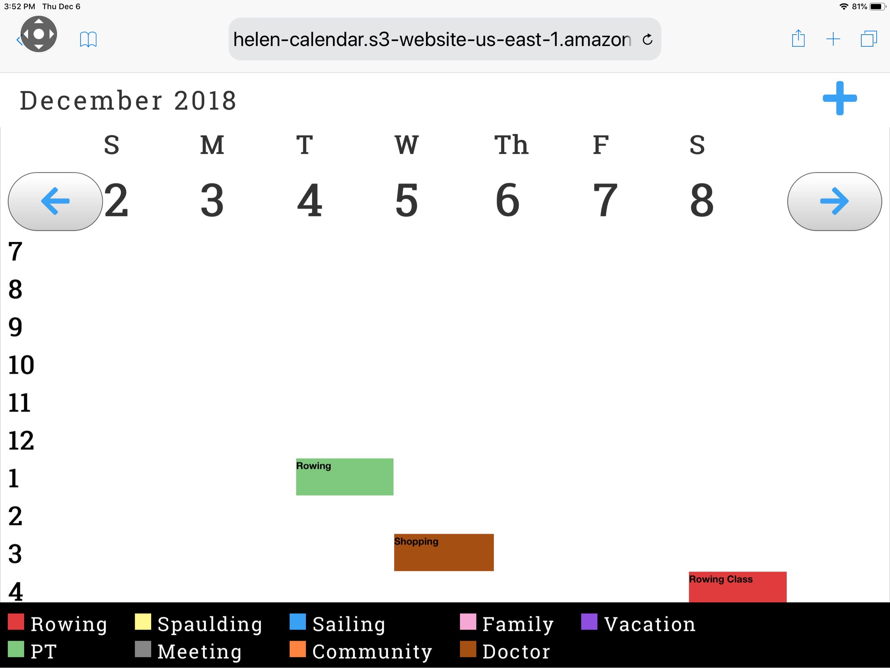

# PPAT_2018-Team_Helen

This is web calendar made for the Fall 2018 MIT PPAT Team Helen. It is a customizable, minimalistic calendar for older people and people with visual impairments. It allows an user to:
* View Events in a weekly view with a particular colour assigned to a particular type of event
* View Each Event individually 
* Add and Delete Events

## Set up

## App Overview
